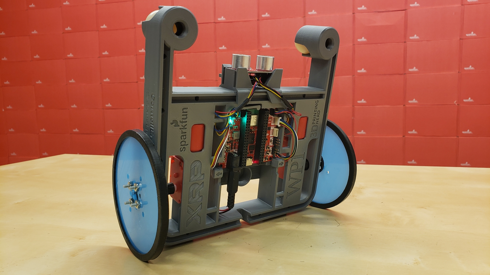

# XRP Balance Bot

This repository documents the XRP Balance Bot! A modification to the base XRP robot with a simple hardware change that opens up a brand new project requiring new software and control theory concepts with numerous expansion possibilities!

# Hardware

The only things you need are:

* The base XRP Kit: https://www.sparkfun.com/experiential-robotics-platform-xrp-kit.html
    * You will need to remove the servo or mount it elsewhere, because it would otherwise hit the ground.
* Bigger wheels: https://www.printables.com/model/1342650-xrp-balance-bot
    * Any wheels with a 4" diameter or larger should work just fine!

# Software

[Example code](code/balance_bot.py) is provided if you just want to get your robot balancing right away! Though it's also fun to write your own code from scratch to exercise your control theory and programming skills!

# Expansion Ideas

Below are some ideas of how to expand this project to do more:

* Remote control
    * The example code will simply try to keep the robot upright and maintain position. However, it would be awesome to be able to remotely drive the robot with a gamepad!
    * The example code already has placeholders for this feature, take a look at the `target_speed` and `turn_effort` variables. You'll need to modify the code to set these based on gamepad inputs. What cool tricks can you do with your balance bot?
* Deceleration
    * The example code simply uses a PID controller for the target pitch angle. This means when the robot is driving towards its target location, it doesn't slow down nearly soon enough, resulting in a large overshoot of the position.
    * To make the robot stop at the target position, the robot needs to lean back to slow down before it reaches the target. You'll need to change the angle PID controller to something that can look ahead in this way to slow down in time. How accurately can your balance bot drive?
* Re-mount the sensors
    * The XRP includes an ultrasonic distance sensor and a line sensor. The normal clips for those don't really work with the balance bot, so it would be great to design new clips for this new orientation of the XRP!
    * The ultrasonic sensor needs to point forward to see walls and other objects and measure the distance to them. Should it be at the same height, or a different height?
    * The line sensor needs to be close to the gound to see lines. Can you make your XRP balance bot follow a line?
* Mount the servo arm
    * This project requires removing the servo, because the normal location for the clip hits the ground. It would need to be mounted somewhere else with a new clip design to make it useful again.
    * Design a new servo clip the can be used to pick up objects, or even a gripper! What can you pick up with your balance bot?
