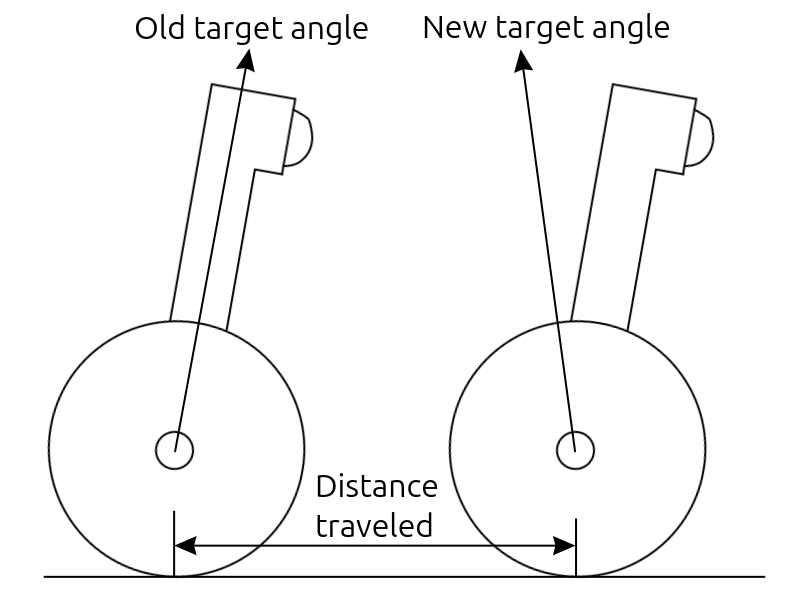

# 1 - XRP Balance Bot Tutorial

This tutorial acts as a guide for anyone wanting to write code for the XRP Balance Bot from scratch. It's intended for anyone who needs help getting started, or for educators needing content to reference. There are many valid solutions to this problem, each with their own benefits and downsides. This tutorial implements the solution from the provided [example code](code/balance_bot.py), which was developed to be relatively easy to understand and follow while providing decent performance that should work for most situations. If you prefer another solution, go for it!

This tutorial assumes you already have experience with the base XRP robot, and are comfortable reading and writing code in Python using basic programming concepts like loops, conditionals, and arithmetic. It utilizes sensors including the drive wheel encoders, gyroscope, and accelerometer. It introduces the PID controller, an industry standard closed-loop feedback control implementation, which is the foundational control theory concept used to keep the robot balanced.

# 2 - Theory

This section covers the theoretical concepts and ideas used in the XRP Balance Bot, and is broken into subsections. The subsections cover the sensors used for this project, physics concepts, and relevant control theory.

## 2.1 - Encoder

Encoders measure how far something has moved. In the case of the XRP, the motors include encoders to measure how much they've rotated, which can be used to know how far the robot has travelled.

## 2.2 - Accelerometer

Accelerometers measure acceleration, and there is one built into IMU on the XRP Control Board with 3 axes. The measured acceleration is a combination of acceleration relative to the ground and gravity.

## 2.3 - Gyroscope

Gyroscopes measure rotation, and there is one built into IMU on the XRP Control Board with 3 axes. You may have already used `imu.get_yaw()` with a normal XRP to get the _yaw_ angle of the robot to drive around. However for the balance bot, we want to measure the _pitch_ angle with `imu.get_pitch()`.

For gyroscopes to get the most accurate measurement, they have to run a brief calibration routine, which happens automatically every time your code calls `from XRPLib.defaults import *`. During the calibration, the IMU needs to be _completely stationary_ to get an accurate calibration, so you should leave the robot lying on the ground until the calibration is done.

## 2.4 Center of Mass/Gravity

If you were to cut the robot into lots of tiny pieces, each has a small amount of mass. Gravity pulls on each tiny piece with a force that's proportional to the mass of that piece.


Gravity pull each piece in the same direction (down), but at different locations. If we computed the average location of these forces weighted by the mass of piece, the average location is what's called the center of gravity (COG) or center of mass (COM). We can simplify this model by assuming all of the gravitational force is applied at this one single point.


The diagrams illustrate the center of mass is perfectly in the center of the XRP for simplicity. But in reality, it's a bit further down and closer to the wheels due to the heavy batteries. So for the XRP Balance Bot to be properly balanced, it has to lean back slightly.

## 2.5 - PID Controller

A PID controller is a type of "closed-loop feedback control", which in this case is used to keep the robot balanced.


There are a lot of resources online about PID control, so we're not going into detail here. If you're not familar with it and want to learn more, the list below links to a few different resources that each explain PID controllers in different ways (there are many more resources if you don't like any of these!):

* [Wikipedia](https://en.wikipedia.org/wiki/Proportional%E2%80%93integral%E2%80%93derivative_controller)
* [Demo video](https://www.youtube.com/watch?v=qKy98Cbcltw)
* [Written guide from Control Sulutions Minnesota](https://csimn.com/CSI_pages/PID.html)
* [Video series from Northwestern Robotics](https://www.youtube.com/watch?v=taSlxgvvrBM&list=PLggLP4f-rq02ecj0q0VB9jEbfua8lOc_E&index=1)
* [WPILib](https://docs.wpilib.org/en/stable/docs/software/advanced-controls/introduction/introduction-to-pid.html)
* [CTRL ALT FTC](https://www.ctrlaltftc.com/the-pid-controller)

You don't necessarily need to know the details of how PID controllers work for this project, because XRPLib provides a built-in PID controller that you can use! However it is useful to be aware of a few things, because you'll have to tune some gain/constant values, and understandig the basics of the PID controller really helps! Specifically:

* Target
    * The output value that you're trying to achieve (eg. the pitch angle of the robot).
* Error
    * How far you are from the target value (eg. the target angle minus the angle measured by the gyroscope).
* `kp` (Proportional gain/constant)
    * Higher values make the output reach the target faster, but too high can results in oscillations and/or "jittery" behavior.
* `ki` (Integral gain/constant)
    * Higher values compensate for "steady-state offset", but too high can result in large oscillations.
* `kd` (Derivative gain/constant)
    * Higher values create a "damping" effect to reduce oscillations, but too high can dampen too much and/or result in "jittery" behavior.

## 2.6 Balance Algorithm

If the center of mass is perfectly above the drive wheels, then the robot is balanced; we'll consider this to be a pitch angle of 0 degrees.


The IMU's gyroscope can be used to measure the pitch angle, however the gyroscope will report 0 degrees when it was calibrated while lying down on the ground. So there is going to be an offset angle between what the gyroscope reports and our ideal 0 degree balanced angle (it's a bit over 90 degrees for the XRP Balance Bot).


If the robot leans forward slightly, then gravity pulls down on the center of mass, creating a torque that causes the robot to lean forward more, until it would eventually fall over.


To prevent that, we need to spin the drive motors to create an opposite torque to keep the center of mass above the wheels.


This is where the PID controller comes in! If we measure some error in the pitch angle, the PID controller tells you how much motor effort is needed to correct it.


This idea works if our target angle is perfectly above the drive wheels, but it will probably be a few degrees off from that ideal angle. In that case, the PID controller would tell us that we need to constantly increase the motor effort to maintain that slightly incorrect angle. The robot would zoom off in one direction and we'd quickly reach the maximum motor effort, at which point the robot would just fall over.


To fix that, we need a way to correct the target angle to the ideal angle. There are a few ways to do this, but the solution presented here is to use a second PID controller based on the drive motor encoders! If it detects that the robot is traveling, it can adjust the target angle in the other direction. This has the added benefit of keeping the robot in roughly the same location while it's balancing.



To keep track of the 2 PID controllers, we'll call the first one the "angle PID controller" since it maintains the pitch angle of the robot, and the second one the "position PID controller" since it maintains the position of the robot.

# 3 - Implementation

This section works through how to implement the code. It is broken into subsections, first setting up the overall code structure, then adding code into relevant places within that structure. Solution code is included at the end of each subsection as collapsible content, like so:

<details>
<summary>Click to reveal solution code</summary>

```diff
 # Example code
 print("Hello world!")
 
+# This line was added
-# This line was deleted
```
</details>

## 3.1 Code Structure

At the start of the code, you'll need to import all required libraries, and initialize any constants and variables. When XRPLib is imported, it calibrates the IMU, during which the robot should be lying on the ground completely stationary. The XRP Balance Bot isn't able to stand itself up from this position, so you'll need to help it by rotating it up to the balance point, at which point the main balance loop starts. The main balance loop should measure the sensor values, update the PID controllers, and set the drive motor efforts. If it detects that the robot has fallen over, we should stop the motors and break out of the main balance loop.

As is, the robot will attempt to balance one time, then stop all code execution once it falls over. If you want to test multiple times, it's easier to nest some code in a second loop that runs forever, so you don't need to re-run the code each time.

<details>
<summary>Click to reveal solution code</summary>
    
```diff
+# Import libraries
+
+# Initialize constants
+
+# Loop forever, allowing the user to stand up the robot and start balancing
+# over and over again
+while(True):
+    # Wait for user to stand up the robot
+
+    # Initialize variables
+
+    # Balance loop
+    while(True):
+        # Measure sensor values
+        
+        # Update PID controllers
+
+        # Set motor efforts
+
+        # If we fall over, stop the motors and break out of the balance loop
```
</details>

## 3.2 Entering and Exiting the Main Balance Loop

Before implementing the balance code and making motors spin, we should first add the code to detect when the robot stands up and when it has fallen over. That way we know when it is safe to start spinning the motors and when they need to stop, because we probably won't get things right the first time, and we don't want the robot to drive off uncontrollably!

There are multiple ways to detect when the robot stands up. For example, you could wait until the pitch angle gets close enough to the offset angle, if you know what that angle is. However, the recommended solution is use the accelerometer to detect a vertical orientation (which is how modern phones and tablets switch between landscape and portait orientations!). The simplest solution is to wait for the z-axis of the accelerometer to get close enough to 0.

Once that happens, we should record the pitch angle measured by the IMU's gyroscope and store that as the offset angle. Within the main balance loop, we can subtract that offset angle from the measured angle to get our desired pitch angle measurement relative to the ideal vertical pitch angle.

At the end of the main balance loop, we can look at the angle to see if it has exceeded some threshold angle, which implies that the robot has fallen over. In that case, we want to stop the drive motors and break out of the balance loop.

It's a good idea to add some print statements at each transition so we can track when each thing happens. You can also make the on board LED illuminate to indicate whether it's waiting to stand up, or is within the balance loop.

Once done, test your code to verify that it starts the main balance loop when stood up, and breaks out of the loop when it falls over. If it doesn't work properly, your robot will likely drive away uncontrollably, so this is an important step!

<details>
<summary>Click to reveal solution code</summary>
    
```diff
 # Import libraries
+from XRPLib.defaults import *
 
 # Initialize constants
 
 # Loop forever, allowing the user to stand up the robot and start balancing
 # over and over again
 while(True):
-    # Wait for user to stand up the robot
+    # Inform user to stand up the robot
+    print("Ready, stand up robot!")
+    board.set_rgb_led(0,64,0)
+
+    # Wait for robot to stand. The balancing point is roughly straight up, at
+    # which point the z-axis of the accelerometer should be around 0. So  we'll
+    # wait until it's within 10 milli-g of zero to start balancing
+    while(abs(imu.get_acc_z()) > 10):
+        pass
+
+    # Inform user that we're starting to balance
+    print("Starting to balance!")
+    board.set_rgb_led(0,0,64)
+
-    # Initialize variables
+    # Get current pitch of robot. We know that we're close to the balancing
+    # point, so this represents the approximate zero pitch angle of the robot
+    angle_offset = imu.get_pitch()
 
     # Balance loop
     while(True):
         # Measure sensor values
+        angle = imu.get_pitch() - angle_offset
         
         # Update PID controllers
 
         # Set motor efforts
 
         # If we fall over, stop the motors and break out of the balance loop
+        if(abs(angle) > 45):
+            print("Effort too large, stopping!")
+            drivetrain.stop()
+            break
```
</details>

## 3.3 Main Loop on a Timer

We need our main balance loop to run quickly; if too much time passes before we update the motor efforts, the PID controllers can over-compensate and make the robot fall over. However, it takes a little bit of time for sensors to update and motors to start spinning (usually a few milliseconds), so we don't need to go faster than that. It's also often beneficial to have a consistent loop period, so we can implement a timer that ensures each loop iteration runs on a consistent schedule.

To implement a loop timer like this, we'll need to track the current time with the `time` module. In MicroPython `time.ticks_ms()` returns the number of milliseconds that have passed since the XRP last powered on. In every loop iteration, we wait until some number of milliseconds have passed since the last loop iteration, then run the loop and repeat. You'll need a variable to track the time of the last loop iteration, and a constant to define how many milliseconds you want between each loop.

<details>
<summary>Click to reveal solution code</summary>
    
```diff
 # Import libraries
 from XRPLib.defaults import *
+import time
 
-# Initialize constants
+# Loop period in seconds. The main loop needs to run relatively fast to ensure
+# the PID controllers can react quickly
+loop_period = 0.01
 
 # Loop forever, allowing the user to stand up the robot and start balancing
 # over and over again
 while(True):
     # Inform user to stand up the robot
     print("Ready, stand up robot!")
     board.set_rgb_led(0,64,0)
 
     # Wait for robot to stand. The balancing point is roughly straight up, at
     # which point the z-axis of the accelerometer should be around 0. So we'll
     # wait until it's within 10 milli-g of zero to start balancing
     while(abs(imu.get_acc_z()) > 10):
         pass
 
     # Inform user that we're starting to balance
     print("Starting to balance!")
     board.set_rgb_led(0,0,64)
 
     # Get current pitch of robot. We know that we're close to the balancing
     # point, so this represents the approximate zero pitch angle of the robot
     angle_offset = imu.get_pitch()
 
+    # Reset loop timer
+    last_loop_ticks_ms = time.ticks_ms()
 
     # Balance loop
     while(True):
+        # Wait until the loop period has passed to ensure the loop runs at a
+        # consistent rate
+        if(time.ticks_ms() < last_loop_ticks_ms + (loop_period * 1000)):
+            continue
+
+        # Update loop timer
+        last_loop_ticks_ms += loop_period * 1000
 
         # Update sensor values
         angle = imu.get_pitch() - angle_offset
 
         # Check the angle and forward effort. If either is too large, the robot
         # has likely fallen over, so stop the motors
         if(abs(angle) > 45):
             print("Effort too large, stopping!")
             drivetrain.stop()
             break
```
</details>

## 3.4 Angle PID Controller

We're ready to implement the first PID controller and make some motors spin! It's best to start with the angle PID controller. XRPLib includes a generic PID class that we can use like so:

```python
# Import PID class
from XRPLib.pid import PID

# Create the angle PID controller
angle_pid = PID(
    kp = <insert number>,
    ki = <insert number>,
    kd = <insert number>,
    max_output = <insert number>
)
```

You'll need to replace each `<insert number>` with actual numbers. For `kp`, `ki`, and `kd`, you'll need to tune these numbers by testing. For `max_output`, you'll need to pick a reasonable value (what's the maximum effort a motor can exert?).

<details>
<summary>Tips for PID tuning</summary>

Start by rough tuning `kp`, because it does the majority of the work; leave `ki` and `kd` at 0. Don't fine tune anything until all 3 values have been rough tuned.

* `kp`
    * Pick a number!
        * It doesn't really matter, start with 1 if you're not sure.
    * Run your code and see how it behaves.
        * If the motors dont seem to do enough, then `kp` needs to be increased.
        * If the motors seem to do way too much, then `kp` needs to be decreased.
    * Increase or decrease `kp`.
        * How much? Start out making it 10x bigger or 10x smaller.
        * PID constants can sometimes be tiny (eg. 0.001) or huge (1000), so you need to first get an idea of what order of magnitude is needed!
    * Test again!
        * If you need to increase or decrease again, do another 10x!
        * Once you've gone too far, pick something between to narrow in.
    * Repeat until you get close.
        * Don't spend much time fine tuning early. A balance bot won't get good performance from `kp` alone, you need to also get `ki` and `kd` close before you can fine tune anything.
* `ki`
    * Start with 0 until `kp` has been tuned.
    * Pick a number!
        * Again, the starting number doesn't really matter, start with 1 if you're not sure.
    * Run your code and see how it behaves.
        * If the behavior is not much different from when `ki` was 0, then `ki` needs to be increased.
        * If there are large oscillations, then `ki` needs to be decreased.
    * Increase or decrease `ki`.
        * Similar to `kp`, start with 10x changes until you go too far, then narrow in.
    * Repeat until you get close.
        * Again, don't spend much time fine tuning until `kp` and `ki` are rough tuned.
* `kd`
    * Start with 0 until `kp` has been tuned.
    * Pick a number!
        * Again, the starting number doesn't really matter, start with 1 if you're not sure.
    * Run your code and see how it behaves.
        * If the behavior is not much different from when `kd` was 0, then `kd` needs to be increased.
        * If the motors move too slow or they start "jittering", then `kd` needs to be decreased.
    * Increase or decrease `ki`.
        * Similar to `kp`, start with 10x changes until you go too far, then narrow in.
    * Repeat until you get close.
        * Again, don't spend much time fine tuning until `kp` and `ki` are rough tuned.

PID tuning can be a very iterative process, with lots of time spent testing, tweaking numbers, and testing again. Be prepared for your robot to fall over _a lot_ (and be ready to catch it!), this is normal. It can also be tricky to know whether the changes you're making are making things better or worse, which is also normal. If you get lost, try resetting `ki` and `kd` to 0, and focus on `kp` first because it does the majority of the work.
</details>

Keep in mind that the angle PID controller is not actually trying to keep the robot balanced, it's trying to hold the robot at the specified angle. That angle is ideally the perfect balance angle, but it's probably wrong, so you should always expect the robot to zoom off in one direction until the max motor effort is reached, and it falls over. If you get to that point, you're doing great! Then it's time to add the second PID controller.

<details>
<summary>Click to reveal solution code</summary>
    
```diff
 # Import libraries
 from XRPLib.defaults import *
+from XRPLib.pid import PID
 import time
 
 # Loop period in seconds. The main loop needs to run relatively fast to ensure
 # the PID controllers can react quickly
 loop_period = 0.01
 
+# Create PID controller that maintains the robot's pitch angle by actuating the
+# motors
+angle_pid = PID(
+    kp = 0.1, # 0.1 corresponds to full effort per 10 degrees
+    ki = 0.25, # 0.25 corresponds to full effort per 4 degree seconds
+    kd = 0.005, # 0.005 corresponds to full effort per 200 degrees per second
+    
+    # Although the motor's max effort is 1, let the PID controller's output be
+    # larger to detect when it goes extremely high, which likely indicates the
+    # robot has fallen over
+    max_output = 10
+)
 
 # Loop forever, allowing the user to stand up the robot and start balancing
 # over and over again
 while(True):
     # Inform user to stand up the robot
     print("Ready, stand up robot!")
     board.set_rgb_led(0,64,0)
 
     # Wait for robot to stand. The balancing point is roughly straight up, at
     # which point the z-axis of the accelerometer should be around 0. So we'll
     # wait until it's within 10 milli-g of zero to start balancing
     while(abs(imu.get_acc_z()) > 10):
         pass
 
     # Inform user that we're starting to balance
     print("Starting to balance!")
     board.set_rgb_led(0,0,64)
 
     # Get current pitch of robot. We know that we're close to the balancing
     # point, so this represents the approximate zero pitch angle of the robot
     angle_offset = imu.get_pitch()
 
+    # Reset PID controllers
+    angle_pid.clear_history()
 
     # Reset loop timer
     last_loop_ticks_ms = time.ticks_ms()
 
     # Balance loop
     while(True):
         # Wait until the loop period has passed to ensure the loop runs at a
         # consistent rate
         if(time.ticks_ms() < last_loop_ticks_ms + (loop_period * 1000)):
             continue
 
         # Update loop timer
         last_loop_ticks_ms += loop_period * 1000
 
         # Update sensor values
         angle = imu.get_pitch() - angle_offset
 
+        # Temporarily set target angle to zero
+        targetAngle = 0
+
+        # Compute forward effort from robot's angle with the PID controller
+        forwardEffort = angle_pid.update(targetAngle - angle)
+
+        # Set motor effort
+        drivetrain.arcade(forwardEffort, 0)
 
         # Check the angle and forward effort. If either is too large, the robot
         # has likely fallen over, so stop the motors
         if(abs(angle) > 45):
             print("Effort too large, stopping!")
             drivetrain.stop()
             break
```
</details>

## 3.5 Position PID Controller

The position PID controller is implemented just like the angle PID controller, but the input is the robot position as measured by the drive motor encoders.

<details>
<summary>Click to reveal solution code</summary>
    
```diff
 # Import libraries
 from XRPLib.defaults import *
 from XRPLib.pid import PID
 import time
 
+# Wheel diameter in cm
+drivetrain.wheel_diam = 10
 
 # Loop period in seconds. The main loop needs to run relatively fast to ensure
 # the PID controllers can react quickly
 loop_period = 0.01
 
 # Create PID controller that maintains the robot's pitch angle by actuating the
 # motors
 angle_pid = PID(
     kp = 0.1, # 0.1 corresponds to full effort per 10 degrees
     ki = 0.25, # 0.25 corresponds to full effort per 4 degree seconds
     kd = 0.005, # 0.005 corresponds to full effort per 200 degrees per second
     
     # Although the motor's max effort is 1, let the PID controller's output be
     # larger to detect when it goes extremely high, which likely indicates the
     # robot has fallen over
     max_output = 10
 )
 
+# Create PID controller that maintains the robot's position by adjusting the
+# target pitch angle
+position_pid = PID(
+    kp = -0.1, # 0.1 corresponds to 1 degree per 10 cm
+    ki = -0.025, # 0.025 corresponds to 1 degree per 40 cm seconds
+    kd = -0.025, # 0.025 corresponds to 1 degree per 40 cm per second
+
+    # Although the angle of the robot will never realistically be more than a
+    # few degrees, let the PID controller's output be a lot larger to give
+    # plenty of margin
+    max_output = 90
+)
 
 # Loop forever, allowing the user to stand up the robot and start balancing
 # over and over again
 while(True):
     # Inform user to stand up the robot
     print("Ready, stand up robot!")
     board.set_rgb_led(0,64,0)
 
     # Wait for robot to stand. The balancing point is roughly straight up, at
     # which point the z-axis of the accelerometer should be around 0. So we'll
     # wait until it's within 10 milli-g of zero to start balancing
     while(abs(imu.get_acc_z()) > 10):
         pass
 
     # Inform user that we're starting to balance
     print("Starting to balance!")
     board.set_rgb_led(0,0,64)
 
     # Get current pitch of robot. We know that we're close to the balancing
     # point, so this represents the approximate zero pitch angle of the robot
     angle_offset = imu.get_pitch()
 
+    # Reset encoder values to zero, this is our initial target position to hold
+    drivetrain.reset_encoder_position()
 
     # Reset PID controllers
     angle_pid.clear_history()
+    position_pid.clear_history()
 
     # Reset loop timer
     last_loop_ticks_ms = time.ticks_ms()
 
     # Balance loop
     while(True):
         # Wait until the loop period has passed to ensure the loop runs at a
         # consistent rate
         if(time.ticks_ms() < last_loop_ticks_ms + (loop_period * 1000)):
             continue
 
         # Update loop timer
         last_loop_ticks_ms += loop_period * 1000
 
         # Update sensor values
         angle = imu.get_pitch() - angle_offset
+        left_position = drivetrain.get_left_encoder_position()
+        right_position = drivetrain.get_right_encoder_position()
+
+        # Compute robot position by averaging the left and right wheel positions
+        bot_position = (left_position + right_position) / 2
+
+        # Set target position
+        target_position = 0
+
+        # Compute target angle from robot's position with the PID controller
+        targetAngle = position_pid.update(target_position - bot_position)
-        # Temporarily set target angle to zero
-        targetAngle = 0
 
         # Compute forward effort from robot's angle with the PID controller
         forwardEffort = angle_pid.update(targetAngle - angle)
 
         # Set motor effort
         drivetrain.arcade(forwardEffort, 0)
 
         # Check the angle and forward effort. If either is too large, the robot
         # has likely fallen over, so stop the motors
         if(abs(angle) > 45 or abs(forwardEffort) > 5):
             print("Effort too large, stopping!")
             drivetrain.stop()
             break
```
</details>

## 3.6 Drive Inputs

If you've got your robot balancing, you'll probably want to drive it around, right? For that, we can do a couple simple modifications to allow a forward speed input, and a turn effort input. These values could be set by gamepad inputs or similar, it's up to you!

<details>
<summary>Click to reveal solution code</summary>
    
```diff
 # Import libraries
 from XRPLib.defaults import *
 from XRPLib.pid import PID
 import time
 
 # Wheel diameter in cm
 drivetrain.wheel_diam = 10
 
 # Loop period in seconds. The main loop needs to run relatively fast to ensure
 # the PID controllers can react quickly
 loop_period = 0.01
 
 # Create PID controller that maintains the robot's pitch angle by actuating the
 # motors
 angle_pid = PID(
     kp = 0.1, # 0.1 corresponds to full effort per 10 degrees
     ki = 0.25, # 0.25 corresponds to full effort per 4 degree seconds
     kd = 0.005, # 0.005 corresponds to full effort per 200 degrees per second
     
     # Although the motor's max effort is 1, let the PID controller's output be
     # larger to detect when it goes extremely high, which likely indicates the
     # robot has fallen over
     max_output = 10
 )
 
 # Create PID controller that maintains the robot's position by adjusting the
 # target pitch angle
 position_pid = PID(
     kp = -0.1, # 0.1 corresponds to 1 degree per 10 cm
     ki = -0.025, # 0.025 corresponds to 1 degree per 40 cm seconds
     kd = -0.025, # 0.025 corresponds to 1 degree per 40 cm per second
 
     # Although the angle of the robot will never realistically be more than a
     # few degrees, let the PID controller's output be a lot larger to give
     # plenty of margin
     max_output = 90
 )
 
 # Loop forever, allowing the user to stand up the robot and start balancing
 # over and over again
 while(True):
     # Inform user to stand up the robot
     print("Ready, stand up robot!")
     board.set_rgb_led(0,64,0)
 
     # Wait for robot to stand. The balancing point is roughly straight up, at
     # which point the z-axis of the accelerometer should be around 0. So we'll
     # wait until it's within 10 milli-g of zero to start balancing
     while(abs(imu.get_acc_z()) > 10):
         pass
 
     # Inform user that we're starting to balance
     print("Starting to balance!")
     board.set_rgb_led(0,0,64)
 
     # Get current pitch of robot. We know that we're close to the balancing
     # point, so this represents the approximate zero pitch angle of the robot
     angle_offset = imu.get_pitch()
 
     # Reset encoder values to zero, this is our initial target position to hold
     drivetrain.reset_encoder_position()
 
     # Reset PID controllers
     angle_pid.clear_history()
     position_pid.clear_history()
 
+    # Reset other values
+    target_position = 0
+    target_speed = 0
+    turn_effort = 0
     
     # Reset loop timer
     last_loop_ticks_ms = time.ticks_ms()
 
     # Balance loop
     while(True):
         # Wait until the loop period has passed to ensure the loop runs at a
         # consistent rate
         if(time.ticks_ms() < last_loop_ticks_ms + (loop_period * 1000)):
             continue
 
         # Update loop timer
         last_loop_ticks_ms += loop_period * 1000
 
         # Update sensor values
         angle = imu.get_pitch() - angle_offset
         left_position = drivetrain.get_left_encoder_position()
         right_position = drivetrain.get_right_encoder_position()
 
         # Compute robot position by averaging the left and right wheel positions
         bot_position = (left_position + right_position) / 2
 
-        # Set target position
-        target_position = 0
+        # Update target position based on target velocity
+        target_position -= target_speed * loop_period
 
         # Compute target angle from robot's position with the PID controller
         targetAngle = position_pid.update(target_position - bot_position)
 
         # Compute forward effort from robot's angle with the PID controller
         forwardEffort = angle_pid.update(targetAngle - angle)
 
         # Set motor effort
-        drivetrain.arcade(forwardEffort, 0)
+        drivetrain.arcade(forwardEffort, turn_effort)
 
         # Check the angle and forward effort. If either is too large, the robot
         # has likely fallen over, so stop the motors
         if(abs(angle) > 45 or abs(forwardEffort) > 5):
             print("Effort too large, stopping!")
             drivetrain.stop()
             break
```
</details>
